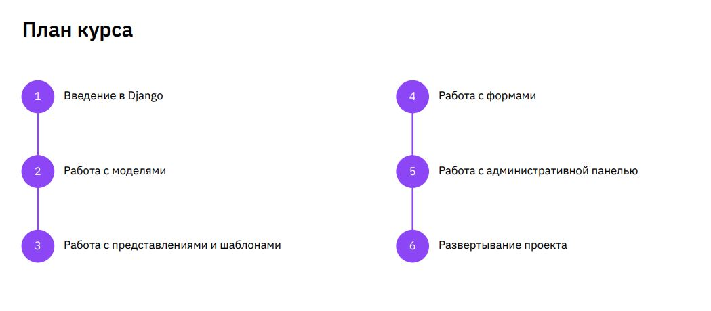

# Фреймворк Django (семинары)

## Описание

В этом репозитории находятся решения заданий с семинаров по Django.
Задания с семинаров распределены по правилу: app_<номер_семинара>/(мб семинары в одном приложении).
Для каждого семинара отводится отдельное приложение, в котором содержится выполнение всех заданий.
В некоторых модулях представлены результаты выполнения сразу нескольких заданий.
Различить их можно по количеству отделённых друг от друга блоков комментариев с заданиями.

